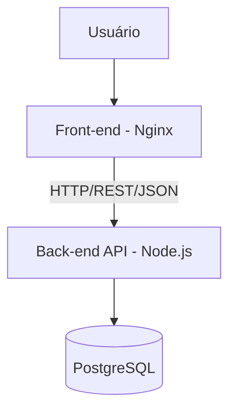
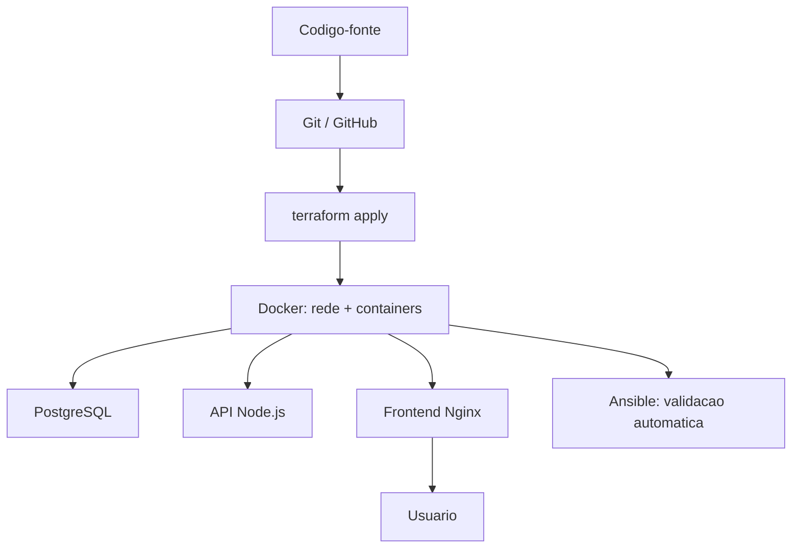

# Sistema da Biblioteca

Sistema de Biblioteca desenvolvido como um MVP para demonstrar a aplicação de práticas **DevOps** e de **Gerência de Configuração**. Sua stack de tecnologia utiliza **Docker, Terraform, Ansible, PostgreSQL, Node.js, Express, Nginx e JWT**.

### Integrantes
* [Luiz](https://github.com/luizsen4) - Desenvolvedor 
* [George Rafhael](https://github.com/George-Rafhael-Dev) - Desenvolvedor DevO

## Arquitetura



Frontend (Nginx) → API (Node.js/Express) → PostgreSQL, todos na rede Docker `biblioteca-net`.

## Infraestrutura



Terraform cria a rede e os containers → Docker executa a aplicação (PostgreSQL, API, Frontend) → Ansible valida o ambiente. Não existe servidor remoto neste fluxo.

## Pré-requisitos

- Docker Desktop com WSL2 (se for no Windows)
- Terraform e Ansible

Verifique com `docker --version`, `terraform --version`, `ansible --version`.

## Configuração

Preencha `.env` (raiz, usado pelo Docker Compose) ou `terraform/terraform.tfvars` (usado pelo Terraform) com as credenciais do banco e o `JWT_SECRET`. Nenhum dos dois é versionado — veja `.gitignore`, `.env.example` e `terraform/terraform.tfvars.example`.  
As dependências do backend (`npm ci`) são instaladas dentro da imagem — não precisa de Node instalado localmente.  
Ao executar os comandos de uma das opções abaixo, cria-se `biblioteca-net`, os containers (`biblioteca-db`, `biblioteca-api`, `biblioteca-frontend`) e o volume do Postgres.

## Opção A — Docker Compose

```bash
docker compose up -d --build
```
ou
## Opção B — Terraform (IaC)

```bash
cd terraform
terraform init
terraform apply
```

## Validação com Ansible

```bash
cd ansible
ansible-playbook -i inventory.ini instalar-biblioteca.yml
```

Roda contra `localhost` (`ansible_connection=local`) — **não existe servidor remoto neste fluxo**. Verifica se os containers subiram e testa API e frontend.

## Acessar

- Frontend: `http://localhost:8080/login.html`
- API: `http://localhost:3000`

O PostgreSQL **não** é exposto ao host por padrão — só acessível pela rede interna. Para debugar com DBeaver/psql, veja `docs/seguranca.md`.

## Parar / destruir

```bash
docker compose down       # se usou Docker Compose
terraform destroy         # se usou Terraform
```

## Documentação adicional

- `docs/API biblioteca.postman_collection.json` — Collection do Postman
- `docs/seguranca.md` — medidas de segurança e DevSecOps